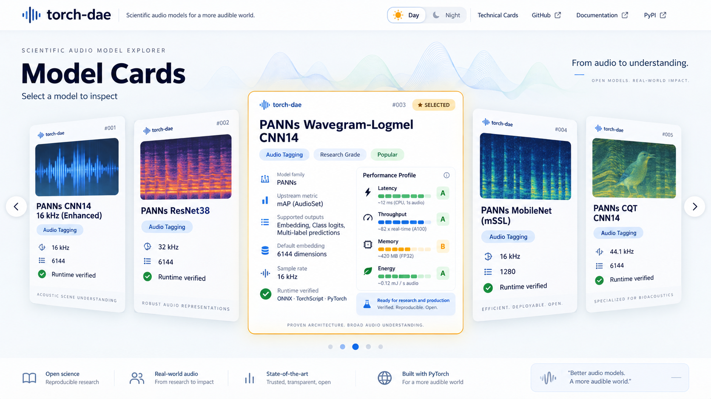
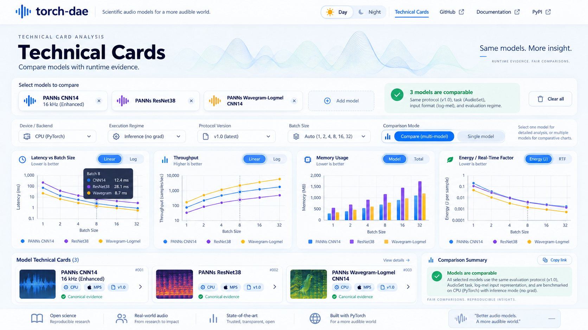
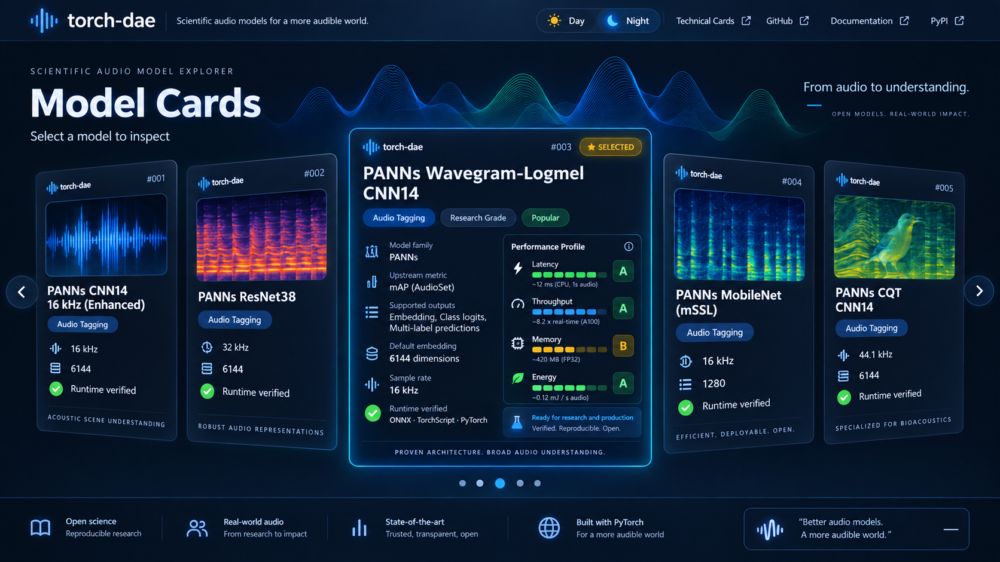
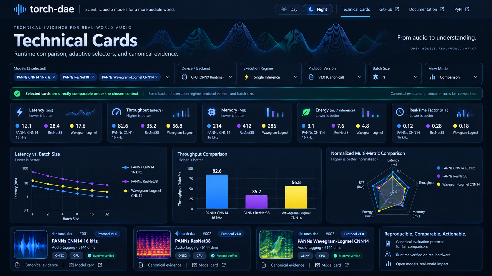

# torch-dae Web Catalogue & Technical Card Explorer
## Product, Data, Interaction, and Visual Specification

**Status:** Design baseline for implementation  
**Target release baseline:** `torch-dae 0.2.0`  
**Website repository:** `torch-dae-web` (separate from the Python project)  
**Primary source of truth:** canonical `torch-dae` repository artifacts  
**Primary users:** audio-ML researchers, practitioners, developers, and users evaluating reusable deep audio models

---

## 1. Product vision

The website is the public, visual, interactive companion to `torch-dae`.

Its purpose is not to reproduce the Python package, Read the Docs documentation, or repository internals. Its purpose is to make canonical `torch-dae` evidence immediately understandable and explorable through two tightly focused views:

1. **Model Cards** — model-oriented discovery, identity, capabilities, scientific context, and runtime-verification status
2. **Technical Cards** — runtime-oriented analysis, filtering, visualization, and comparison under explicit comparability constraints

The site shall expose the same canonical data already maintained by `torch-dae`, but through a polished scientific-product interface rather than repository JSON files.

The target aesthetic is a hybrid of:

- scientific dashboard
- premium product catalogue
- sports-card / collectible-card interaction
- appliance-style visual performance labeling
- dark/light modern research tooling

The final implementation should remain visually close to the approved mockups rather than treating them as loose inspiration.

---

## 1.1 Repository and ownership boundary

The website is developed in a **separate repository** named `torch-dae-web`.

The Python/scientific project and the website have different responsibilities:

```text
torch_dae
├── Python package
├── CLI
├── Model Cards
├── Technical Cards
├── schemas
├── verification evidence
└── canonical scientific/runtime provenance

torch-dae-web
├── static web application
├── build-time ingestion adapter
├── normalized presentation data
├── interactive Model Card catalogue
├── Technical Card explorer
├── charts and comparison logic
└── static deployment
```

The website repository must never become an alternate authoring location for canonical `torch-dae` evidence.

During local development, the canonical source repository is expected at:

```text
/Users/stefano/Documents/torch-dae
```

Treat that repository as **read-only** from website implementation agents. Reading files and running non-mutating Git inspection commands is allowed. Agents must not modify, checkout, pull, reset, install into, or commit inside the source repository.

Production catalogue builds consume an explicit released `torch-dae` ref/tag, initially:

```text
v0.2.0
```

The actual resolved commit SHA must be discovered and recorded at build/sync time rather than assumed in source code.

The website repository itself is expected locally at:

```text
/Users/stefano/Documents/torch-dae-web
```

The implementation specification, agent context, work prompts, and approved mockups are project-control inputs. Implementation agents must not rewrite or replace them unless a later review explicitly authorizes that change.

---

## 2. Product principles

### 2.1 Repository artifacts remain authoritative

The website is a **read-only consumer** of canonical artifacts.

It shall not:

- edit Model Cards
- edit Technical Cards
- create new scientific evidence
- approve lifecycle transitions
- redefine profiling metrics
- infer unsupported verification states
- maintain an independent manually edited database of card contents

The canonical source remains the `torch-dae` repository.

### 2.2 Scientific metrics and runtime metrics are separate domains

Model-level scientific information and Technical Card runtime information must never be visually conflated.

Examples:

**Model Card / scientific domain**
- model family
- task
- training/evaluation dataset
- upstream reported metrics
- input/output contract
- embeddings
- runtime-verification lifecycle

**Technical Card / runtime domain**
- latency
- throughput
- real-time factor
- speed factor
- memory
- energy
- device/backend
- execution regime
- protocol version
- batch size
- environment/provenance

### 2.3 Comparability is explicit

The Technical Card page must never imply that two runtime measurements are comparable unless the selected context satisfies the comparability contract.

The UI must state one of the following:

- **Directly comparable**
- **Partially comparable**
- **Not directly comparable**

and explain why.

### 2.4 Raw evidence remains accessible

Every rendered summary should preserve a path back to machine-readable canonical evidence.

Where available, the UI should expose links to:

- Model Card JSON
- Technical Card JSON
- associated NPZ raw measurement asset
- repository source
- verification evidence / provenance references

---

## 3. Visual design references

The approved mockups are normative visual references for the implementation.

The downloaded images should be stored in the website repository using the following names:

```text
assets/mockups/
├── home-light.png
├── technical-light.png
├── home-night.png
└── technical-night.png
```

Reference them in this specification as follows:

### 3.1 Model Cards — light theme



### 3.2 Technical Cards — light theme



### 3.3 Model Cards — night theme



### 3.4 Technical Cards — night theme



> **Important:** the visual composition, spacing, card hierarchy, selector layout, theme treatment, and interaction concept are design targets. Numeric values, fictional models, qualitative labels, and other mockup-only content are illustrative and must not be treated as canonical data.

---

## 4. Navigation model

The site deliberately has only **two internal primary pages**.

```text
/
└── Model Cards catalogue

/technical-cards
└── Technical Card explorer
```

The persistent top navigation contains:

- **Theme toggle** — Day / Night
- **Technical Cards** — internal navigation
- **GitHub** — external repository
- **Documentation** — external Read the Docs `latest`
- **PyPI** — external latest package page

Recommended destinations:

```text
GitHub
https://github.com/StefanoGiacomelli/torch_dae

Documentation
https://torch-dae.readthedocs.io/en/latest/

PyPI
https://pypi.org/project/torch-deepaudioembedding/
```

The `torch-dae` logo/title in the navbar returns to `/`.

No additional top-level pages are required for the MVP.

Methodology, evidence explanations, and provenance details should be provided through:

- tooltips
- contextual information drawers
- inline help
- links to Read the Docs

rather than duplicating the full documentation site.

---

# 5. Global layout behavior

## 5.1 Full-viewport application

Both primary pages are designed as fixed-height viewport experiences.

Target behavior:

```css
height: 100dvh;
overflow: hidden;
```

The page itself should not require vertical scrolling under supported desktop/laptop viewport sizes.

The interface must resize proportionally and preserve its visual hierarchy across browsers and screen sizes.

### 5.2 Responsive principle

The goal is **layout equivalence**, not physically identical pixel dimensions.

Use:

- CSS Grid
- Flexbox
- `clamp()`
- `min()`
- `max()`
- `aspect-ratio`
- viewport units
- container queries
- responsive typography

The desktop layout is the flagship rendering.

Suggested behavior:

| Viewport | Model carousel |
|---|---|
| Large desktop | ~5 cards visible |
| Standard laptop | 3–5 cards visible |
| Tablet landscape | ~3 cards visible |
| Mobile | 1 selected card + lateral preview/peek |

For narrow/mobile layouts, controlled internal scrolling or compacted panels may be permitted if required for usability. The desktop experience remains strictly non-scrollable.

---

# 6. Theme system

The site provides equal-quality Day and Night themes.

Night mode is the visual flagship, but Day mode must not be a secondary or degraded implementation.

## 6.1 Night palette

Recommended baseline:

```text
Background        #06182B / #081C31
Surface           #0B223D
Surface elevated  #0E294A
Primary           #2D9CFF
Cyan accent       #21D4FD
Positive          #2DDB8A
Warning           #F6B73C
Text primary      #F3F7FC
Text secondary    #AFC3D9
Border subtle     rgba(120,180,240,0.20)
```

## 6.2 Day palette

Recommended baseline:

```text
Background        #F5F9FD
Surface           #FFFFFF
Surface elevated  #F9FCFF
Primary           #1677E8
Cyan accent       #2DBCEB
Positive          #24B36B
Warning           #E6A424
Text primary      #0B1D39
Text secondary    #5C708C
Border subtle     rgba(30,90,150,0.15)
```

## 6.3 Model comparison colors

Each selected model receives a stable comparison color.

Recommended ordered palette:

```text
blue
violet
amber
teal
magenta
```

The assignment must remain stable:

- across all charts on the page
- across selectors and legends
- ideally across sessions for the same model ID

Colors must not be assigned randomly on every render.

---

# 7. Homepage: Model Cards catalogue

The homepage is already the model catalogue.

It must not begin with a conventional landing-page hero followed by a scrolling model list.

The entire viewport should feel like an interactive catalogue.

## 7.1 Primary structure

```text
Navbar

Title / compact context
"Model Cards"
"Select a model to inspect"

Central card carousel

Pagination / position indicator

Compact footer strip
```

The visual center of gravity is the carousel.

---

# 8. Model Card carousel behavior

## 8.1 Idle state

Several model cards are visible simultaneously.

A typical desktop composition is:

```text
partial / secondary
secondary
SELECTED / central
secondary
partial / secondary
```

The center card is slightly larger even before full expansion.

## 8.2 Navigation

Supported interaction:

- previous/next arrows
- trackpad/mouse-wheel horizontal rolling where appropriate
- drag/swipe
- keyboard left/right
- pagination dots
- click a partially visible card to bring it to the center

Transitions must be smooth and physically coherent.

## 8.3 Hover state

Hover should produce only a restrained premium-product effect:

- small elevation
- subtle glow/border
- slight scale increase
- cursor affordance

Avoid excessive 3D tilt or decorative animation.

## 8.4 Selection state

When a card is selected:

1. it moves to the central position
2. it scales up
3. neighboring cards shift outward
4. additional details unfold **inside the same card**
5. the transition preserves spatial continuity

Do not use:

- modal dialogs
- separate model-detail pages
- full-screen overlays
- navigation to another route

The Model Card itself transforms into the detailed state.

---

# 9. Compact Model Card anatomy

The compact card must expose only data that can be read instantly.

Recommended fields:

- model display name
- stable model ID or short card index
- model family
- primary task
- sample rate
- embedding dimension
- runtime-verification status
- optional representative visual asset

Example conceptual structure:

```text
┌────────────────────────────┐
│ torch-dae              #001│
│                            │
│ [visual identity asset]    │
│                            │
│ PANNs CNN14                 │
│ Audio Tagging              │
│                            │
│ 16 kHz                     │
│ 2048-D embedding           │
│ ✓ Runtime verified         │
└────────────────────────────┘
```

Only canonical or directly derived data may appear.

Avoid unformalized marketing badges such as:

- Popular
- State-of-the-art
- Research Grade
- Production Ready
- Best
- Recommended

unless they are later defined by an explicit, versioned rule.

---

# 10. Expanded Model Card anatomy

The selected card expands in-place and exposes deeper information.

Recommended sections:

## 10.1 Identity

- display name
- model ID
- family
- architecture / variant
- upstream implementation/source
- checkpoint identity

## 10.2 Scientific profile

- primary task
- dataset / evaluation context
- upstream reported metric(s)
- explicit source/provenance marker

Upstream scientific values must be visually labeled as such.

Example:

```text
Upstream reported mAP
0.438
AudioSet
```

The UI must not imply that an upstream scientific score was locally reproduced unless canonical evidence explicitly states that.

## 10.3 Input contract

Examples:

- waveform
- `[B, 1, T]`
- sample rate
- minimum length/duration
- notable input constraints

## 10.4 Outputs

Examples:

- logits
- probabilities
- embedding
- tensor dimensions

## 10.5 Embedding contract

- default embedding name
- dimension
- location/semantic meaning if available

## 10.6 Runtime-verification status

Show evidence-aware states such as:

```text
CPU       ✓ verified
Apple MPS ✓ verified
CUDA      upstream-declared / locally unverified
```

Never collapse upstream capability and local runtime verification into one generic “supported” indicator.

---

# 11. Performance summary inside the expanded Model Card

The expanded card may contain a compact Technical-Card-derived performance summary, but only when a clearly defined default runtime context exists.

The context must be visible or available through tooltip.

Example:

```text
Reference runtime context
CPU · native_default · batch 1 · audio-inference-v1
```

Recommended summary metrics:

- latency
- throughput
- real-time factor
- memory
- energy, only when available and meaningful

Always show the raw value.

Example:

```text
Latency
12.4 ms
▮▮▮▮▮▮▯▯
```

---

# 12. Appliance-style performance scales

The visual inspiration from appliance energy labels is accepted, but must remain scientifically defensible.

## 12.1 MVP rule

Use:

- numeric raw values
- colored gradient bars / segmented scales
- explicit “higher is better” / “lower is better” semantics

Do **not** initially use unqualified categorical labels such as:

```text
A
B
C
D
...
```

because such grades would require a formally defined normalization and threshold policy.

## 12.2 Future optional grade system

A future `A–G` system is acceptable only if:

- thresholds are formally specified
- the definition is versioned
- the reference population is explicit
- the selected device/protocol context is explicit
- grades are not confused with upstream scientific quality metrics

---

# 13. Model visual identity assets

Each Model Card may include a representative visual asset.

Preferred categories:

- waveform art
- spectrogram / mel-spectrogram art
- architecture-derived abstract representation
- controlled task-semantic imagery
- project-generated illustrations

Avoid copyrighted upstream imagery unless license and attribution are explicitly compatible.

The website should preferably use first-party assets created for the catalogue.

---

# 14. Technical Cards page

Route:

```text
/technical-cards
```

This page is the runtime analysis and comparison workspace.

Its visual structure follows the approved Technical Cards mockups closely.

## 14.1 Primary composition

```text
Navbar

Compact page title

Adaptive selector row

Comparability status bar

Metric summary cards

Dynamic chart workspace

Selected model / evidence cards
```

The page remains full-viewport and non-scrollable on target desktop viewports.

---

# 15. Technical Card selector system

Selectors must be dynamic and context-sensitive.

Recommended selector order:

1. **Models**
2. **Device / Backend**
3. **Execution Regime**
4. **Protocol Version**
5. **Batch Size**
6. **View Mode**

Conceptual example:

```text
Models
[PANNs CNN14] [PANNs ResNet38] [Wavegram-Logmel]

Device / Backend
CPU

Execution Regime
native_default

Protocol Version
audio-inference-v1 / 1.0.0

Batch Size
1

View Mode
Comparison
```

---

# 16. Adaptive selector behavior

Selectors must not behave as independent arbitrary dropdowns.

Every selection constrains the next valid options.

Example:

1. user selects multiple models
2. UI computes shared Technical Card contexts
3. only shared device/backend values remain selectable
4. execution regimes update
5. valid protocol versions update
6. valid batch sizes update
7. charts update accordingly

Invalid combinations must either:

- disappear from selectors
- become disabled with an explanation
- trigger a clear “not directly comparable” state

The user should never be able to accidentally create a misleading comparison without the UI making the incompatibility explicit.

---

# 17. Comparability engine

Comparability is a first-class data rule, not a frontend cosmetic feature.

A comparison context should evaluate relevant fields including, where applicable:

- profiling protocol ID
- profiling protocol version
- device/backend
- execution regime
- batch size
- input duration
- input representation / task context when encoded
- required environment/runtime context
- metric availability

The exact rule set must be derived from canonical Technical Card schemas and profiling semantics.

## 17.1 UI states

### Directly comparable

Use positive green status:

```text
✓ Selected cards are directly comparable under the chosen context
```

### Partially comparable

Use amber:

```text
! Some metrics cannot be compared under the selected context
```

Then render only valid shared metrics as comparative plots.

### Not directly comparable

Use neutral/red warning:

```text
Selected cards are not directly comparable
```

Explain the conflicting attributes.

Do not generate normalized comparative charts in this state.

---

# 18. Single-model Technical Card mode

If exactly one model is selected, the Technical Cards page becomes a detailed runtime analyzer.

Recommended plots:

- latency vs batch size
- throughput vs batch size
- memory vs batch size
- RTF vs batch size
- speed factor vs batch size
- energy vs batch size, when available
- detailed statistical summaries where encoded

The layout may allocate larger chart regions because no comparison legends are required.

---

# 19. Multi-model comparison mode

If multiple models are selected and directly comparable, render comparative views.

Recommended plots:

- latency curves
- throughput curves/bars
- memory comparison
- RTF comparison
- speed-factor comparison
- energy comparison, when shared and valid
- normalized multi-metric radar, with strict rules

The UI should animate between single-model and comparison layouts.

---

# 20. Metric summary cards

A compact row of summary metrics may appear above the main plots.

Examples:

```text
Latency
12.1 ms
Lower is better

Throughput
82.6 infer/s
Higher is better

Memory
214 MB
Lower is better

Energy
3.1 mJ/inference
Lower is better

RTF
0.12
Lower is better
```

For multi-model selection, each metric card may include:

- one value per model
- stable model colors
- a micro-chart/sparkline
- tooltip with raw context

---

# 21. Radar / normalized multi-metric visualization

The approved mockup includes a radar visualization.

It is accepted, but only under explicit rules.

The chart title should state:

```text
Normalized Multi-Metric Comparison
```

The normalization method must be documented in tooltip/help.

Rules:

- use only metrics available for all compared cards
- never mix runtime metrics with upstream scientific quality metrics
- make directionality explicit
- for “lower is better” metrics, inversion may be used only in the normalized visual layer
- raw values remain accessible in tooltip/table
- normalized values must never replace raw values as canonical measurements

---

# 22. Energy semantics

Energy requires special handling.

Never interpret missing energy as zero.

Possible states include:

```text
measured
estimated
partial coverage
unavailable
```

Where represented by canonical artifacts, expose relevant fields such as:

- coverage completeness
- unaccounted components
- energy backend/provider
- privilege requirements
- measurement availability

If energy is not mutually valid for compared cards, omit it from comparative plots rather than fabricating equivalence.

---

# 23. Animation and interaction rules

Animation should communicate state transition, not decorate the page.

## 23.1 Recommended durations

Typical range:

```text
150–350 ms
```

Longer transitions only for major card expansion/reflow.

## 23.2 Preferred easing

Use smooth physical easing such as:

```text
cubic-bezier(...)
spring-like motion where appropriate
```

## 23.3 Animate

- carousel translation
- selected card scale/expansion
- selector-dependent chart transitions
- series enter/exit
- theme transition
- comparability status changes
- metric panel rearrangement

## 23.4 Avoid

- gratuitous looping motion
- large parallax
- excessive card tilt
- continuously animated backgrounds that compete with data
- animations that delay interaction

Respect `prefers-reduced-motion`.

---

# 24. Navbar

Persistent top navbar structure:

```text
[torch-dae logo]

[Day / Night]

Technical Cards
GitHub ↗
Documentation ↗
PyPI ↗
```

When on `/technical-cards`, mark the Technical Cards item as active.

On the homepage, the logo/title is the active product identity.

External links should visibly indicate that they leave the website.

---

# 25. Footer / lower strip

The mockup lower strip is accepted as a visual device, but should remain concise and factual.

Possible items:

```text
Open source
Reproducible evidence
PyTorch ecosystem
torch-dae 0.2.0
```

Avoid unsupported claims or marketing superlatives.

---

# 26. Data source architecture

The site shall not use the PyPI wheel as the canonical card source.

Canonical Model/Technical Card artifacts live at repository level and are not equivalent to package runtime modules.

## 26.1 Production source

Recommended production input:

```text
torch-dae GitHub release/tag snapshot
```

rather than mutable live `main`.

Example:

```text
catalogSourceRef = v0.2.0
```

Development builds may optionally target:

```text
main
local checkout
```

## 26.2 Update model

Preferred production sequence:

```text
new torch-dae release
        ↓
website build triggered
        ↓
cards fetched/read from release snapshot
        ↓
validated
        ↓
normalized
        ↓
static site generated
```

This keeps the web catalogue aligned with a released, citable state.

---

# 27. Build-time ingestion layer

The site should include one small build-time data adapter rather than spreading repository schema knowledge throughout UI components.

Conceptual pipeline:

```text
model_cards/**/*.json
technical_cards/**/*.json
schemas/**/*.json
        │
        ▼
validate
        │
        ▼
normalize
        │
        ├── model index
        ├── technical-card index
        ├── model ↔ technical-card joins
        ├── selector facets
        └── comparability contexts
        │
        ▼
frontend-ready data
```

This is not a second database.

Generated data is disposable build output.

---

# 28. Minimal normalized frontend model

The frontend should consume compact normalized TypeScript structures.

Conceptual example:

```ts
type CatalogueModel = {
  id: string
  displayName: string
  family: string
  task: string[]
  sampleRateHz?: number
  embeddingDimension?: number
  runtimeVerified: boolean
  verificationBackends: VerificationBackend[]
  upstreamMetrics: UpstreamMetric[]
  technicalCardIds: string[]
}
```

```ts
type CatalogueTechnicalCard = {
  id: string
  modelId: string
  protocolId: string
  protocolVersion: string
  device: DeviceContext
  executionRegime: string
  metrics: RuntimeMetricSet
  rawAsset?: RawAssetReference
  provenance: ProvenanceReference
}
```

Exact fields must follow the actual `torch-dae` schema rather than the illustrative structures above.

---

# 29. Technology stack

Recommended stack:

```text
Astro
TypeScript
React islands
```

Use Astro for:

- static generation
- routing
- layout
- SEO/meta
- build-time catalogue ingestion

Use React only for interactive islands:

- Model Card carousel
- Model Card expansion
- Technical Card selectors
- charts
- comparison state
- theme control where needed

Recommended charting options to evaluate during implementation:

- Apache ECharts
- Observable Plot
- Recharts
- Vega-Lite/Vega

The chosen library must support:

- responsive SVG/canvas rendering
- smooth animated transitions
- accessible legends/tooltips
- line charts
- bar charts
- radar charts
- theme switching

No backend is required for the MVP.

---

# 30. Deployment

Preferred deployment classes:

- GitHub Pages
- Cloudflare Pages
- Netlify

The site should compile to static assets.

No runtime Python server is required.

No authentication is required.

No database is required.

---

# 31. Performance requirements

Target:

- immediate initial visual response
- minimal client bundle
- no blocking fetch of large NPZ assets
- lazy-load model imagery where possible
- load raw Technical Card evidence only on explicit request
- charts should render from normalized JSON summaries

The website must not download NPZ assets simply to render standard overview charts if equivalent canonical summary statistics already exist in Technical Card JSON.

---

# 32. Accessibility requirements

Minimum requirements:

- keyboard navigation through carousel and selectors
- visible focus states
- WCAG-compatible contrast
- color is not the sole encoding of model identity
- chart series use color + marker/line distinction
- tooltip information accessible without hover-only dependency where practical
- `prefers-reduced-motion`
- semantic buttons/links
- theme choice stored locally without requiring an account

---

# 33. Provenance UI

Provenance is a first-class feature.

Each expanded Model Card should provide access to:

- canonical Model Card
- verification evidence
- repository source

Each Technical Card context should provide access to:

- canonical Technical Card JSON
- raw NPZ asset where applicable
- model identity
- protocol identity/version
- source revision
- environment/device context

A compact provenance drawer is preferred over introducing separate detail pages.

---

# 34. Non-goals for MVP

Do not implement:

- card editing
- CMS
- user accounts
- admin dashboard
- model inference in browser
- checkpoint download manager
- runtime Python backend
- proprietary API server
- global “best model” ranking
- opaque composite performance score
- AI-generated claims about model quality
- cross-context comparison without comparability checks
- arbitrary interpolation between Technical Cards
- automatic loading of raw NPZ evidence for all cards

---

# 35. Initial content baseline

The first production implementation should be tested against the canonical `torch-dae 0.2.0` catalogue.

The UI must be capable of rendering:

- all accepted Model Cards
- all canonical Technical Cards
- one-to-many Model Card → Technical Card relationships
- multiple runtime contexts per model
- incomplete metric coverage
- verified and unverified capability distinctions

The implementation must remain generic enough to support future model families without redesigning the two-page interaction model.

---

# 36. MVP acceptance criteria

The MVP is accepted only when all of the following are true.

## 36.1 Homepage / Model Cards

- page occupies the viewport on target desktop resolutions
- no vertical page scrolling
- carousel navigation works by mouse and keyboard
- selected Model Card expands in-place
- compact and expanded states render canonical data
- runtime-verification states are evidence-aware
- no unsupported qualitative claims are displayed
- Day/Night switching works without layout shifts
- theme persists between visits

## 36.2 Technical Cards

- one or multiple models can be selected
- selectors adapt to available Technical Card contexts
- comparability status updates automatically
- single-model mode renders detailed runtime plots
- multi-model mode renders only mutually valid comparative metrics
- raw metric values remain accessible
- missing energy is never rendered as zero
- normalized charts disclose normalization semantics
- links to canonical evidence work

## 36.3 Navigation

- GitHub points to the canonical repository
- Documentation points to Read the Docs `latest`
- PyPI points to the official distribution page
- internal Technical Cards navigation is immediate
- logo/title returns to Model Cards homepage

## 36.4 Data integrity

- build validates consumed card artifacts
- frontend does not hardcode scientific/runtime values
- canonical IDs are preserved
- Model ↔ Technical Card joins are deterministic
- invalid contexts cannot silently produce misleading comparisons

## 36.5 Responsive rendering

- desktop layout closely matches approved mockups
- laptop layout preserves all primary controls
- tablet layout remains usable
- mobile degrades gracefully while preserving core inspection capability

---

# 37. Visual implementation fidelity

The approved mockups are intended as a high-fidelity target.

During implementation, prioritize fidelity in:

- navbar height and density
- central card proportions
- expanded-card hierarchy
- page-level spacing
- selected-card glow/elevation
- selector row organization
- comparability status bar
- metric-card proportions
- chart-grid density
- dark/light theme identity
- typography scale
- rounded corners and subtle borders
- bottom information strip

Changes from the mockup are acceptable when required by:

- canonical data semantics
- accessibility
- responsive behavior
- realistic text length
- actual Technical Card dimensionality
- scientific correctness

Visual fidelity must never override data correctness.

---

# 38. Open design decisions before implementation

The following items should be decided explicitly before or during the first implementation phase:

1. final logo asset and typography
2. exact font family
3. canonical model visual-identity strategy
4. selected-card default Technical Card context
5. exact comparability rule implementation from schemas/protocol
6. chart library
7. whether URL query state encodes Technical Card selections
8. maximum number of simultaneously compared models
9. default comparison palette
10. whether the footer strip is always visible on compact laptop viewports
11. exact breakpoints / container thresholds
12. production deployment provider
13. automatic site rebuild trigger after a new `torch-dae` release

---

# 39. Suggested implementation repository structure

```text
torch-dae-web/
├── AGENT_CONTEXT.md
├── TORCH_DAE_WEB_SPEC.md
├── prompts/
│   ├── 00_CHAT_BOOTSTRAP.md
│   ├── 00_WEB_IMPLEMENTATION_WORKPLAN.md
│   ├── 01_FOUNDATION_DATA_CONTRACT.md
│   ├── 02_MODEL_CARDS_HOME.md
│   ├── 03_TECHNICAL_CARDS_ENGINE.md
│   ├── 04_VISUALIZATION_AND_POLISH.md
│   └── 05_PRODUCTION_QA_DEPLOYMENT.md
│
├── public/
│   ├── assets/
│   │   ├── branding/
│   │   ├── models/
│   │   └── mockups/
│   └── favicon.*
│
├── src/
│   ├── components/
│   │   ├── navigation/
│   │   ├── model-cards/
│   │   ├── technical-cards/
│   │   ├── charts/
│   │   └── common/
│   │
│   ├── data/
│   │   ├── ingest/
│   │   ├── normalize/
│   │   ├── comparability/
│   │   └── types/
│   │
│   ├── layouts/
│   ├── pages/
│   │   ├── index.astro
│   │   └── technical-cards.astro
│   │
│   ├── styles/
│   │   ├── tokens.css
│   │   ├── themes.css
│   │   └── global.css
│   │
│   └── config/
│
├── tests/
│   ├── data/
│   ├── comparability/
│   └── ui/
│
├── assets/
│   └── mockups/
│       ├── home-light.png
│       ├── technical-light.png
│       ├── home-night.png
│       └── technical-night.png
│
├── TORCH_DAE_WEB_SPEC.md
├── astro.config.*
├── package.json
└── README.md
```

The exact structure may evolve, but data ingestion/comparability logic should remain separated from presentation components.

---

# 40. Accepted-phase implementation journal

Because every implementation phase is executed in a fresh Claude/Codex chat, accepted decisions must survive outside conversational memory.

Each accepted phase shall maintain a concise repository journal:

```text
docs/implementation/
├── phase-01.md
├── phase-02.md
├── phase-03.md
├── phase-04.md
└── phase-05.md
```

Each journal file records only durable implementation facts needed by later phases:

- architecture actually implemented;
- important file locations;
- data contracts/interfaces introduced;
- intentional deviations from this specification;
- validation commands;
- constraints that later phases must preserve.

The journal is not a replacement for Git history or the external review bundle. It is a compact continuity mechanism for fresh-agent chats.

---

# 41. Implementation philosophy for Claude / Codex

The implementation should be divided into bounded phases, each with explicit acceptance gates.

The coding agents should not be asked to “build the whole site” in one prompt.

Each phase should provide:

- scope
- files allowed to change
- source-of-truth references
- design reference screenshots
- functional acceptance criteria
- visual acceptance criteria
- tests to add/run
- stop condition

The next planning activity should define these phases and produce copy-paste-ready prompts for Claude/Codex.

A likely decomposition is:

```text
Phase W0
Repository scaffold + design tokens + mockup assets

Phase W1
Canonical data ingestion + normalized types

Phase W2
Model Cards homepage + carousel + expanded state

Phase W3
Technical Card selectors + comparability engine

Phase W4
Charts + animated comparison layouts

Phase W5
Responsive polish + accessibility + theme fidelity

Phase W6
Production data/release integration + deployment
```

This decomposition is provisional and should be refined before implementation.

---

# 42. Final product definition

The final site should feel like:

> a premium scientific catalogue for deep audio models, where Model Cards communicate what a model is and Technical Cards communicate how it behaves under reproducible runtime conditions.

The product must remain:

- visually distinctive
- scientifically conservative
- evidence-linked
- data-driven
- release-aligned
- static and maintainable
- fast to navigate
- immediately understandable
- extensible to future `torch-dae` model families

The approved mockups define the intended experience. The canonical `torch-dae` artifacts define the truth.
